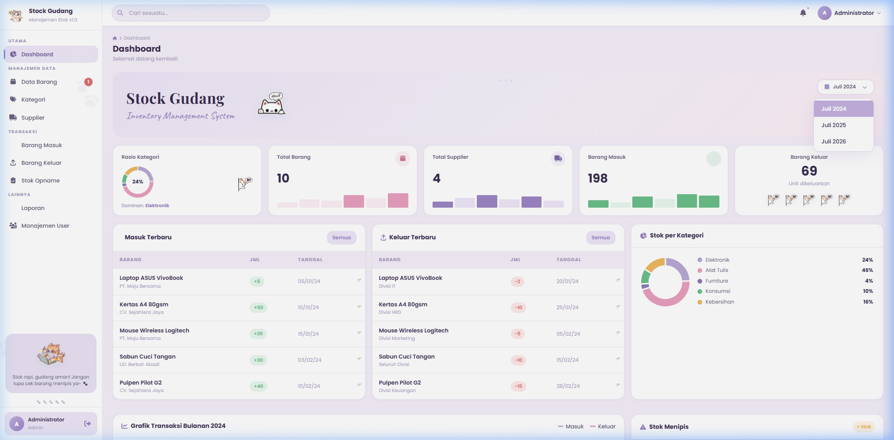
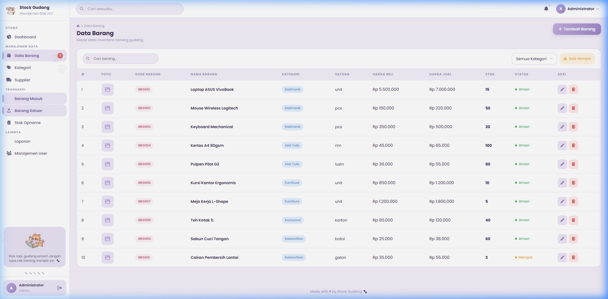
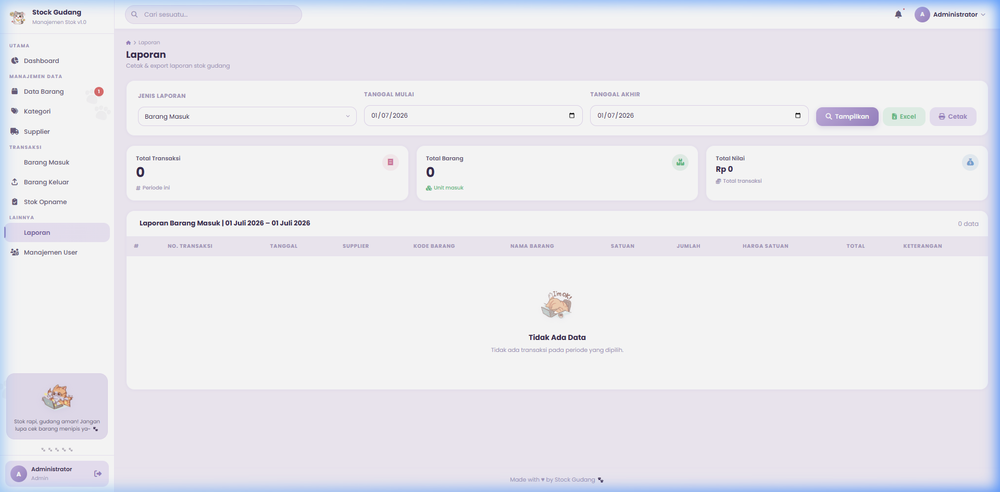

# 🐾 Stock Gudang — Kawaii Pastel Purple Theme 💜

Aplikasi **Manajemen Inventaris & Stok Gudang** yang didesain secara responsif dengan tema estetika *Pastel Purple* yang anggun serta dihiasi oleh ilustrasi kucing yang menggemaskan. Aplikasi ini dirancang khusus untuk kebutuhan **Ujian Kompetensi Keahlian (UKK) Rekayasa Perangkat Lunak**.

---

## 📸 Tampilan Aplikasi (Screenshots)

### 📊 Dashboard Interaktif & Filter Kalender
Tampilan utama yang menyajikan ringkasan statistik stok, grafik mingguan/bulanan (Chart.js), dan filter kalender dropdown interaktif.

### 📦 Manajemen Data Inventaris (CRUD Barang)
Pengelolaan katalog barang lengkap dengan filter status stok (Menipis, Aman, Habis), upload foto, dan input stok minimum.

### 📈 Laporan Stok & Cetak PDF / Excel
Halaman laporan per periode untuk barang masuk dan keluar dengan fitur ekspor ke dokumen Excel asli serta layout cetak ramah printer.

---

## 🎨 Tema & Estetika Visual
- **Palet Warna:** Perpaduan manis warna *Lavender Muda*, *Pink Peach*, dan warna dasar putih bersih.
- **Dekorasi Maskot:** Karakter kucing lucu (`cat-laptop`, `cat-hi`, `cat-peek`) yang membuat tampilan aplikasi terasa premium, ceria, dan tidak membosankan.
- **Efek Transisi:** Animasi halus pada kartu statistik saat halaman dimuat (*hover effects*) dan bayangan lembut (*soft shadows*) pada modal data.
- **Desain Responsif:** Layout dioptimalkan 100% untuk browser layar PC maupun smartphone (mobile) menggunakan teknik Grid/Flexbox tanpa framework CSS luar.

---

## ✨ Fitur Utama Aplikasi
1. **📊 Dashboard Real-time:**
   - Counter otomatis jumlah barang, supplier, barang masuk, dan barang keluar.
   - Grafik Transaksi Bulanan menggunakan **Chart.js** yang dapat difilter dinamis berdasarkan tahun (**2024, 2025, 2026**) melalui tombol kalender.
2. **📦 CRUD Data Barang:**
   - Mengelola data barang (Kode, Nama, Kategori, Satuan, Harga Beli, Harga Jual, Stok Minimum, dan Foto).
   - Indikator status stok dinamis (Aman, Menipis, Habis) berdasarkan nilai stok minimum.
3. **🏷️ CRUD Kategori & Supplier:**
   - Pengelompokan barang berdasarkan kategori dengan validasi pengaman (kategori tidak bisa dihapus jika masih ada barang di dalamnya).
   - Pengelolaan kontak dan detail supplier.
4. **📥 Transaksi Barang Masuk & Keluar:**
   - Pencatatan barang masuk dan keluar yang secara otomatis memperbarui (*update*) stok barang di database.
   - Generator nomor transaksi otomatis (contoh: `BM-2026-0001` untuk barang masuk).
   - Filter pencarian cepat dan filter berbasis rentang tanggal.
5. **📝 Stok Opname (Revaluasi Fisik):**
   - Halaman khusus untuk mencocokkan stok sistem komputer dengan jumlah fisik barang di gudang.
6. **📈 Laporan & Export:**
   - Rekap transaksi berdasarkan rentang tanggal.
   - Fitur cetak langsung (*print layout*) dan ekspor ke file Microsoft Excel (*binary stream* bersih dari bug corrupt).
7. **🔒 Sistem Autentikasi & Hak Akses:**
   - Halaman login dengan validasi data dan enkripsi password aman (`password_hash`).
   - Tingkatan hak akses:
     - `Admin` $\rightarrow$ Akses penuh ke seluruh fitur dan Manajemen Akun Pengguna.
     - `Gudang` $\rightarrow$ Akses manajemen data barang, transaksi, dan stok opname.
     - `Viewer` $\rightarrow$ Hak akses baca-saja (*read-only*) untuk dashboard dan tabel data.

---

## 🛠️ Spesifikasi Teknologi
- **Bahasa Pemrograman:** PHP 8.x (Native MySQLi Object-Oriented)
- **Desain Antarmuka:** HTML5, Vanilla CSS3 (Responsive Grid & Flexbox), FontAwesome v6.5
- **Mesin Database:** MySQL / MariaDB
- **Library Frontend:** Chart.js (melalui CDN lokal), Google Fonts (Poppins & Playfair Display)

---

## 🚀 Panduan Instalasi & Jalankan Aplikasi
1. **Unduh Proyek:**
   Salin atau ekstrak folder proyek ini ke dalam folder server lokal Anda, contoh: `C:\xampp\htdocs\ukk-cia\`.
2. **Setup Database:**
   - Buka browser lalu akses **phpMyAdmin** (`http://localhost/phpmyadmin/`).
   - Buat database baru bernama `stock_gudang`.
   - Pilih database tersebut, klik tab **Import**, lalu pilih file SQL dari folder proyek: `database/stock_gudang.sql`. Klik **Go/Import**.
3. **Konfigurasi Server:**
   - Jika kredensial database MySQL Anda berbeda dari default, buka file [database.php](file:///c:/XAMPP/htdocs/ukk%20cia/config/database.php) dan sesuaikan username/password MySQL Anda.
4. **Jalankan:**
   - Aktifkan Apache dan MySQL di XAMPP Control Panel.
   - Buka browser Anda dan akses alamat: `http://localhost/ukk-cia/`.

---

## 🔑 Akun Uji Coba Default
Gunakan akun di bawah ini untuk menguji berbagai tingkat hak akses sistem:

| Peran (Role) | Username | Password |
|---|---|---|
| 👑 Administrator | `admin` | `password` |
| 📦 Staff Gudang | `gudang` | `password` |
| 👁️ Viewer | `viewer` | `password` |

---

## 👩‍💻 Catatan Penguji UKK (Arsitektur Kode Bersih)
- **Struktur Rapi & Konsisten:** Seluruh AJAX request dipisahkan ke dalam folder `ajax/` tanpa tag penutup PHP (`?>`) untuk menghindari spasi tak terlihat (*whitespaces*) yang dapat merusak header HTTP.
- **Modular & DRY (Don't Repeat Yourself):** Navigasi aktif di sidebar diatur dinamis menggunakan PHP di [sidebar.php](file:///c:/XAMPP/htdocs/ukk%20cia/includes/sidebar.php) tanpa redundansi kode JavaScript.
- **Page-scoped CSS:** Tag body menggunakan penanda dinamis `<body class="page-<?= $page_param ?>">` sehingga styling halaman tertentu dapat dikustomisasi secara terisolasi tanpa merusak layout halaman lainnya di `style.css`.
